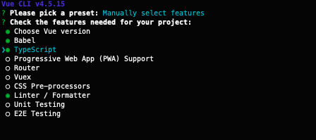
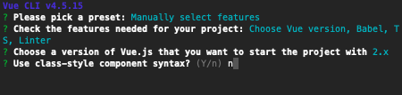

# Vue 基础

- 掌握 Vue 的基础语法
- 掌握 Vue 结合 TS 的开发技巧

通过上一节课的课后任务我们可以感受到，手动创建、管理页面的 DOM 是非常繁琐的，而且需要手动管理状态，保证数据和 DOM 的同步，如果遇到一些交互比较复杂的场景，实现起来又会变得更加困难。现在通过 Vue 可以让我们从 DOM 操作中解放出来，让创建大型复杂应用变得非常轻松，这节课来学习一下 Vue 的基础知识。

## 组件化思想

组件系统是现代 Web 开发中的一个重要概念，它允许我们使用小型、独立通常可复用的组件构建大型应用，几乎任意类型的应用界面都可以抽象为一个组件树。我们可以简单认为组件是 Web 页面中的一个独立的功能单元，它可以有自己的状态、DOM 结构、逻辑交互，组件最大的价值是可复用性，我们只需要将独立的功能代码封装成组件，需要使用的时候传递给它对应的数据就可以了，不需要再额外编写重复的功能代码。


上图来自 Vue 文档，我们可以看到，左侧的页面结构经过拆分，可以用右侧的组件树来表示，上层的节点通常是一些布局用的组件，可复用度比较低，最底层的通常是一些最小的功能单元，可复用性比较高。

## 使用[Vue](https://v3.cn.vuejs.org/guide/introduction.html)

Vue 读作 View，是一套构建用户界面的渐进式框架。Vue 官方自带了构建工具，若我们需要构建 Vue 项目时，直接使用`vue-cli`即可。

1. 安装 vue-cli

```
$ npm i -g @vue/cli
```

安装结束后，输入`vue --version`若能正常显示版本信息，则安装成功。

2. 构建项目

```
<!-- 自定义项目名称 -->
$ vue create [project_name]
```

运行完该命令之后，会选择`Vue`版本，或者选择自定义的一些工具。这里我们选择`vue 2.x`的版本即可。

等待片刻即可构建成功，然后按照提示运行项目即可。

### 简单组件

一个简单的`Vue`组件采用类似下面的代码进行定义

```vue
<template>
  <div>Hello {{ name }}</div>
</template>

<script>
export default {
  name: "HelloMessage",
  props: {
    name: String,
  },
};
</script>

<style></style>
```

一个 Vue 组件就是一个`.vue`文件，分为三个部分: `template`、`script`、`style`。template 是 dom 部分，script 是逻辑部分，style 是样式部分。

### template 语法

`Vue`使用了基于 HTML 的模板语法，允许开发者声明式地将 DOM 绑定至底层 Vue 实例的数据。

```html
<template>
  <div id="app">
    <div>姓名：{{ name }}</div>
    <button @click="printName">打印</button>
    <button @click="changeName">改变</button>
  </div>
</template>

<script>
  export default {
    name: "App",
    data: () => ({
      name: "hahh",
    }),
    methods: {
      printName: function () {
        console.log(this.name);
      },
      changeName: function () {
        this.name = this.name + this.name;
      },
    },
  };
</script>

<style>
  #app {
    font-family: Avenir, Helvetica, Arial, sans-serif;
    -webkit-font-smoothing: antialiased;
    -moz-osx-font-smoothing: grayscale;
    text-align: center;
    color: #2c3e50;
    margin-top: 60px;
  }
</style>
```

一个`.vue`文件就是一个页面或者一个组件，和 HTML 类似，它包含三个部分，`template`、`script`、`style`。

#### template

`template`的部分就是类似 HTML 的语法，但是可以绑定一些方法以及动态的值。

其中的 DOM 的样式绑定也与 HTML 有一些不同。具体内容可以参照[该文档](https://v3.cn.vuejs.org/guide/class-and-style.html)。

#### script

其中`script`的部分中`export default`了一个`Object`，该 Object 包含了三个属性：

- `name`: 该组件的名称
- `data`: 组件的`data`选项是一个函数。Vue 会在创建新组件实例的过程中调用此函数。它应该返回一个对象，对象中的键值对可以被组件的方法以及模板所使用。
- `methods`: 它是一个对象，其中包含了组件中的方法。

除了这几个基础的属性之外，还有许多的其他的属性，例如[watch 和 computed](https://v3.cn.vuejs.org/guide/computed.html)

#### style

该部分是该组件中的样式部分，和普通的 css 语法没有差别，但是存在一些 Vue 的特性，详情见[该文档](https://v3.cn.vuejs.org/api/sfc-style.html)。

以上就是 Vue 语法一些简单介绍，相较于手动的去更新 DOM 节点，Vue 只需要去更新 DOM 中的数据即可。接下来将重点介绍如何绑定、更新 DOM 的数据。

### 数据绑定

将数据绑定到 DOM 节点或者 DOM 的属性。可以分为数据的类型或者绑定的位置来区分。

- 文本

绑定文本类型的数据，最常见的形式就是使用`{{...}}`(双括号)的形式。

```html
<div>{{ message }}</div>
```

- HTML

绑定 html 格式的数据。使用 `v-html` [指令](https://v3.cn.vuejs.org/guide/template-syntax.html#%E6%8C%87%E4%BB%A4)在 DOM 中插入 HTML 语句。

```html
<div id="app">
  <div v-html="message"></div>
</div>

<script>
  new Vue({
    el: "#app",
    data: {
      message: "<h1>金山办公</h1>",
    },
  });
</script>
```

> ⚠️ 慎用该方法，会有[XSS](https://developer.mozilla.org/zh-CN/docs/Glossary/Cross-site_scripting)安全风险。

- 属性

将数据绑定至 DOM 的属性上，不可以使用双括号语法对 HTML 的属性进行赋值，但是可以使用`v-bind`指令：

```html
...
<a v-bind:href="url">baidu</a>
... 
data: () => ({ url: "http://www.baidu.com" })
...
```

- 使用 JavaScript 表达式

不仅可以绑定值，也可以在绑定的地方进行一些值的 JavaScript 操作。

```html
<!-- 尽量少的在模板语法中使用下面的写法，模板语法要尽量的简单。 -->
{{ number + 1 }} {{ ok ? 'YES' : 'NO' }} {{ message.split('').reverse().join('')
}}

<div v-bind:id="'list-' + id"></div>
```

### Data 和 Methods

#### Data

组件的 `data` 选项是一个函数。Vue 在创建这个组件实例的过程中会调用该函数。该函数应该返回一个对象。

```ts
export default {
  data() {
    return {
      firstName: "",
      lastName: "",
    };
  },
};
```

返回的对象中的数据可以在 template 以及 methods 等位置中使用它。

```vue
<template>
  {{ firstName + " " + lastName }}
</template>
<script>
export default {
  data() {
    return {
      firstName: "",
      lastName: "",
    };
  },
  methods: {
    getFullName() {
      return this.firstName + " " + this.lastName;
    },
  },
};
</script>
```

#### Methods

`methods` 属性用于在 vue 组件中添加方法，被创建的方法可以在 template 以及 methods 等位置中使用它。

```vue
<template>
  <button @click="greet">打招呼</button>
</template>
<script>
export default {
  data() {
    return {
      firstName: "",
      lastName: "",
    };
  },
  methods: {
    greet() {
      alert(this.getFullName());
    },
    getFullName() {
      return this.firstName + " " + this.lastName;
    },
  },
};
</script>
```

### Props

`Props`是定义在子组件上，用于向子组件传递数据的属性。`HelloWorld.vue`的`script`中有一个`props`字段，该字段用于声明使用该组件时所需要传入的值。并且组件可以对传入的值进行简单的数据校验。

#### Props 类型与校验

```js
export default {
  props: {
    // 基础的类型检查 (`null` 和 `undefined` 值会通过任何类型验证)
    propA: Number,
    // 多个可能的类型
    propB: [String, Number],
    // 必填的字符串
    propC: {
      type: String,
      required: true,
    },
    // 带有默认值的数字
    propD: {
      type: Number,
      default: 100,
    },
    // 带有默认值的对象
    propE: {
      type: Object,
      // 对象或数组的默认值必须从一个工厂函数返回
      default() {
        return { message: "hello" };
      },
    },
    // 自定义验证函数
    propF: {
      validator(value) {
        // 这个值必须与下列字符串中的其中一个相匹配
        return ["success", "warning", "danger"].includes(value);
      },
    },
    // 具有默认值的函数
    propG: {
      type: Function,
      // 与对象或数组的默认值不同，这不是一个工厂函数——这是一个用作默认值的函数
      default() {
        return "Default function";
      },
    },
  },
};
```

#### Props 的使用

当数据传到子组件之后，我们该如何使用呢？其使用方法和 `data`属性中的数据使用方法一致。

```vue
<template>
  <div>{{ name }}</div>
</template>;
<script>
export default {
  props: {
    name: String,
  },
  methods: {
    printName: function () {
      console.log(this.name);
    },
  },
};
</script>
```

### 计算属性和侦听器

#### 计算属性

之前说过我们可以在数据绑定时使用 js 表达式来进行一些简单的数据处理。

```vue
<!-- 通过name的长度来判断显示的内容 -->
<template>
  {{ name.length > 5 ? "Yes" : "No" }}
</template>
<script>
export default {
  data() {
    return {
      name: "新未来训练营",
    };
  },
};
</script>
```

如若在模板中多次包含此计算，模板将非常的复杂并且可读性降低。对于这种包含响应式数据的复杂逻辑，都应该使用`计算属性`。

```vue
<!-- 通过name的长度来判断显示的内容 -->
<template>
  {{ showYesOrNo }}
</template>
<script>
export default {
  data() {
    return {
      name: "新未来训练营",
    };
  },
  computed: {
    // 完整写法
    showYesOrNo: {
      // 当读取showYesOrNo时调用
      // 依赖数据变化时调用
      get() {
        return this.name.length > 5 ? "Yes" : "No";
      },
      // 当showYesOrNo被修改时调用
      set(newVal) {
        // ...
      },
    },
    // 只需get时的简写
    showYesOrNo() {
      return this.name.length > 5 ? "Yes" : "No";
    },
  },
};
</script>
```

以上的例子声明了一个计算属性 showYesOrNo, 我们当然可以使用 Methods 来替换它。

```vue
<!-- 通过name的长度来判断显示的内容 -->
<template>
  {{ showYesOrNo() }}
</template>
<script>
export default {
  data() {
    return {
      name: "新未来训练营",
    };
  },
  methods: {
    showYesOrNo() {
      return this.name.length > 5 ? "Yes" : "No";
    },
  },
};
</script>
```

> Methods 和 计算属性 都可以实现上述的需求，那他们有什么区别呢？

#### 侦听器

```vue
<!-- 通过name的长度来判断显示的内容 -->
<template>
  {{ showYesOrNo }}
</template>
<script>
export default {
  data() {
    return {
      name: "新未来训练营",
      showYesOrNo: "",
    };
  },
  watch: {
    // 每当name发生变化时，该函数将会执行。
    name(newVal, oldVal) {
      // 在这里可以执行异步任务
      console.log(oldVal);
      this.showYesOrNo = newVal.length > 5 ? "Yes" : "No";
    },
    // 完整写法
    name: {
      // 是否初次加载就监听，默认是false
      immediate: true,
      // 是否深度监听，默认是false，当监听的是一个对象时，需要监听其中的参数，就需要deep
      deep: true,
      handler(newVal, oldVal) {
        console.log(oldVal);
        this.showYesOrNo = newVal.length > 5 ? "Yes" : "No";
      },
    },
  },
};
</script>
```

#### 计算属性、侦听器与方法的区别

1. 方法不存在缓存，执行一次运行一次，执行 n 次则运行 n 次
2. 计算属性有缓存，调用多次只会执行一次，不能执行异步任务
3. 侦听器能执行异步任务，计算属性能完成的，侦听器能完成，侦听器能完成的，计算属性不一定完成。

> 一般的使用计算属性来完成需求，当计算属性无法满足时，在使用侦听器来完成。

### [指令](https://v3.cn.vuejs.org/api/directives.html)

指令是带有`v-`前缀的特殊属性。像之前提到的`v-bind`、`v-html`。它的职责是，当表达式的值改变时，将其产生的连带影响，响应式地作用于 DOM。

下面将介绍常见的几种指令：

- `v-bind`

  用于响应式地更新 HTML 属性，可以缩写为`:`

```html
<a v-bind:href="url">url</a>

<a :href="url">url</a>
```

- `v-on`

  用于监听 DOM 事件，可以缩写为`@`

```html
<button v-on:click="handleClick">按钮</button>

<button @click="handleClick">按钮</button>
```

- `v-for`

  用于处理循环渲染

- `v-if`

  用于处理条件渲染

- `v-model`

  用于数据的双向绑定

> 不同的指令都有不同的修饰符可以使用，修饰符可以限定一些指令的效果。具体的内容可以查看其详细文档。

### 循环渲染

我们可以用 v-for 指令基于一个数组来渲染一个列表。v-for 指令需要使用 item in items 形式的特殊语法，其中 items 是源数据数组，而 item 则是被迭代的数组元素的`别名`。

```html
<!-- item: [{id: 1, message: "hello"}] -->
<ul id="array-rendering">
  <li v-for="item in items" v-bind:key="item.id">{{ item.message }}</li>
</ul>
```

> 循环渲染的节点，需要带上一个唯一的 key。

循环不止一个参数，还存在第二个参数：

```html
<!-- item: [{id: 1, message: "hello"}] -->
<ul id="array-rendering">
  <li v-for="(item, index) in items" v-bind:key="item.id">
    {{ index }} - {{ item.message }}
  </li>
</ul>
```

循环不仅可以遍历数组，也可以遍历对象。

```html
<!-- item: { name: "xxx", age: 18 } -->
<ul id="array-rendering">
  <li v-for="(value, key, index) in items" v-bind:key="key">
    {{ index }} - {{ key }} - {{ value }}
  </li>
</ul>
```

相较于遍历数组的最多两个参数，遍历对象可以最多三个参数，分别是`value`、`key`、`index`。

> 循环遍历的语法中的 in 关键字可以替换成 of，v-for="item of items"

#### 数组的更新检测

不同于数据绑定只需更新对应的变量，循环渲染的数组的更新限定了相应的方法。

- 变更方法

  - push
  - pop
  - shift
  - unshift
  - splice
  - sort
  - reverse

- 替换数组

  以上的一些方法会直接修改数组本身，还有一些其他的数组的方法也可以修改数组，但仅仅会返回最新的数组。例如`filter`、`slice`、`concat`。当使用这些方法时，我们可以直接使用新的数组来代替旧的数组。

```js
example1.items = example1.items.filter((item) => item.message.match(/Foo/));
```

### 条件渲染

使用`v-if`指令条件性的**渲染**一块内容。这块内容只有在指令的**表达式为真时，才会被渲染**。

```html
<div v-if="type === 'A'">A</div>
<div v-else-if="type === 'B'">B</div>
<div v-else-if="type === 'C'">C</div>
<div v-else>Not A/B/C</div>
```

如上面的代码，不仅存在`v-if`，还存在`v-else-if`、`v-else`的语法。如同 js 中的`if-else`语句。

除了`v-if`这个指令可以控制元素是否**展示**之外，`v-show`指令同样可以控制。

```html
<div v-show="ok">hahh</div>
```

当 ok 为真时，该元素会被**展示**出来。但这个元素一直是存在页面中的，ok 值的改变仅仅影响的是该节点的`display`属性。

### 事件处理

我们可以使用 `v-on` 指令 (通常缩写为 `@` 符号) 来监听 DOM 事件，并在触发事件时执行一些 JavaScript。用法为 `v-on:click="methodName" `或使用快捷方式 `@click="methodName"`

```html
<template>
  <div id="app">
    <button @click="printName">hahhh</button>
  </div>
</template>

<script>
  export default {
    name: "App",
    data: () => ({
      name: "hahh",
    }),
    methods: {
      printName: function () {
        console.log(this.name);
      },
    },
  };
</script>
```

如上面的代码，首先在`methods`属性中定义了一个 printName 方法，然后在 template 中使用`@click`绑定到 button 上。

除了上述直接绑定方法之外，还可以以下两种方法进行事件处理。

1. 直接执行 JS

```html
<button @click="console.log(111)">button</button>
```

2. 内联处理器中的方法

```html
<template>
  <div id="app">
    <button @click="printName('hah')">hahhh</button>
  </div>
</template>

<script>
  export default {
    name: "App",
    data: () => ({
      name: "hahh",
    }),
    methods: {
      printName: function (name) {
        console.log(name);
      },
    },
  };
</script>
```

有时也需要在内联语句处理器中访问原始的 DOM 事件。可以用特殊变量 `$event` 把它传入方法：

```html
<template>
  <div id="app">
    <button @click="printName('hah', $event)">hahhh</button>
  </div>
</template>

<script>
  export default {
    name: "App",
    data: () => ({
      name: "hahh",
    }),
    methods: {
      printName: function (name, event) {
        console.log(name);
      },
    },
  };
</script>
```

> v-on 指令不仅仅可以监听 click 事件，还可以监听 keyup、keydown 等原生 DOM 事件，若 v-on 用在自定义组件中，也可以监听子组件触发的自定义事件。

> v-on 有较多的修饰符可以对其进行修饰，具体的使用方法参照[该文档](https://v3.cn.vuejs.org/api/directives.html#v-on)。

### 数据的双向绑定

可以用 v-model 指令在表单 \<input>、\<textarea> 及 \<select> 元素上创建双向数据绑定。它会根据控件类型自动选取正确的方法来更新元素。尽管有些神奇，但 v-model 本质上不过是语法糖。它负责监听用户的输入事件来更新数据，并在某种极端场景下进行一些特殊处理。

```html
<input v-model="value" />
```

等同于

```html7
<input :value="value" @input="onInput" />
...
methods: {
   onInput: function(event) {
    this.value = event.target.value;
  }
}
...
```

v-model 在内部为不同的输入元素使用不同的 property 并抛出不同的事件：

- input 和 textarea 元素使用 `value` property 和 input 事件；
- checkbox 和 radio 使用 `checked` property 和 change 事件；
- select 字段将 `value` 作为 prop 并将 change 作为事件。

## Vue3 结合 TS

Vue 对于 3.x 对于 TS 相较于2.x 来说支持的更好，TS 对于前端开发来说是一个趋势，无论是 React 还是使用Node.JS开发服务端，使用 TS 开发都是必须掌握的技能。

### 从构建开始

若需使用 TS 进行 Vue3 项目进行开发，我们需要在项目初始化时就进行选择。

`Vue Cli` 可以直接使用 TS 生成新工程。

```bash
$ vue create your-project-name
# 此时选择 "Manually select features (手动选择特性)" 选项
```



这里选择 Typescript 的选项



在`Use class-style compoonent syntax（是否选择class风格组件语法）`这里输入**n**，不使用该种风格。该种风格对于初学者有较高的学习成本，所以使用最基础的 TS 写法即可。

这样一个`Vue+TS`的项目就构建好了。

### 语法

使用 TS 的写法和基础的 Vue 语法略有不同。

1. 要想获得 TS 的类型支持，需要在 script 标签上声明 ts。

```html
<script lang="ts"></script>
```

2. 基础语法

由于 Vue 声明文件的循环特性，TypeScript 可能难以推断 computed 的类型。因此，你可能需要注解计算属性的返回类型。

```html
<script lang="ts">
  import { defineComponent } from 'vue';
  export default defineComponent({
    name: "App",
    components: {
      HelloWorld,
    },
    data() {
      return {
        msg: "hello",
      };
    },
    methods: {
      // 需要标注有 `this` 参与运算的返回值类型
      greet(): string {
        return this.msg + " world";
      },
    },
    computed: {
      // 需要标注
      greeting(): string {
        return this.greet() + "!";
      },
    },
  });
</script>
```

如果你发现校验器并没有得到类型推导或命名补全不工作，用预期的类型标注参数可能会助你解决这类问题。

3. Props 的 TS 标注

虽然 Props 自带了一些类型校验的内容，但对于复杂一些类型例如 Object 来说，类型的限定还是不够。Vue 在 TS 中增加了这一块的支持。

```ts
import Vue, { PropType } from "vue";
interface Person {
  name: string;
  age: number;
}
export default Vue.extends({
  props: {
    person: {
      type: Object as PropType<Person>,
    },
  },
});
```

> 以上内容只讲解了最基础的vue语法以及ts用法，并没有使用真正的vue3的语法。Composition Api的语法在下节课程讲解。


## 课后任务

本次的课后任务是使用Vue+TypeScript改写之前的Dribbble首页，具体实现方式可以参考demo中的示例工程，要求：

- 合理拆分设计Vue组件
- 实现过程可以参考 `demo` 中的示例代码
- 之前Dribbble作业如果有反馈的样式问题，需要在本次作业中完善优化，比如列数应该从1到4逐级过渡
- 修改 `README.md` 记录作业完成的思路和遇到的问题
- 代码在下周五之前提交至 `task` 仓库的 `week-05` 目录

## 额外任务

自行学习 Vue 文档中 API 列表，了解各种 API 的使用场景。

[https://cn.vuejs.org/v2/api/](https://cn.vuejs.org/v2/api/)
