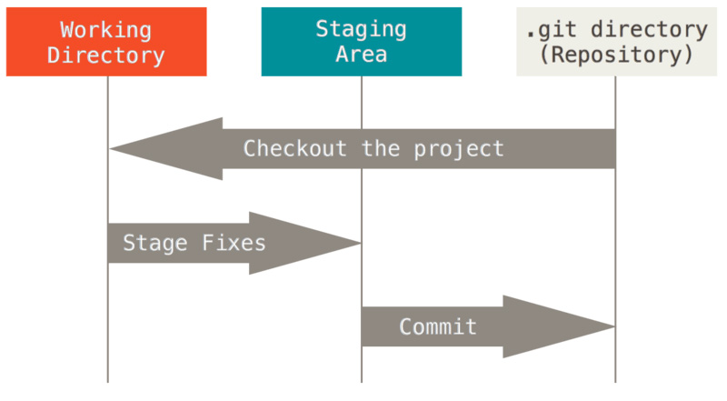

# 基础入门

本章主要介绍前端的一些基本概念和开发环境的搭建，通过分析具体的示例代码，对HTML、CSS建立一个基本的认识。

## 认识前端

- 广义上来说，所有界面相关的开发都可以称为前端，包括网页、PC软件界面、手机App界面等。
- 这里我们所说的前端主要泛指Web前端，即网页应用的开发。
- Web前端已经扩展到一些原生应用的开发领域，如React Native。

## 前端的组成结构

- HTML：用来定义网页内容和结构，目前最新规范是HTML5。
- CSS：用来定义网页样式，目前最新规范是CSS3。
- JavaScript：用来处理页面逻辑和用户交互，遵循ECMAScript规范，目前最大的版本改动来自ES6，之后不断有新的提案加入新版本。

## TypeScript

- [https://www.typescriptlang.org/](https://www.typescriptlang.org/)，也可以参考中文翻译版本：[https://www.tslang.cn/](https://www.tslang.cn/)
- TS是微软开发的脚本语言，在JS的基础上增加了强大的类型系统，为大型项目、多人协作、代码重构等提供了强大支持。
- TS是JavaScript的超集，最终被编译成纯净的JavaScript执行。
- TS在编译时会对类型进行检查，避免很多不必要的代码错误。
- IDE支持良好，开发效率更高。
- 目前有越来越多的大型项目和公司使用TS，如VSCode、Angular、Vue3
- 本课程将以TypeScript替代JavaScript进行教学。

## 主流框架

- [React](https://zh-hans.reactjs.org/)：Facebook开源的前端框架，目前全世界流行度最高，开创JSX模板语法，是本课程重点要讲解的框架。
- [Vue](https://cn.vuejs.org/)：知名程序员尤雨溪开发的前端框架，在中国具有非常高的人气，本课程会作为选修内容讲解。
- [Angular](https://angular.cn/)：Google开源的前端框架，使用TypeScript开发，Angular在大型工程中使用广泛，本课程中不做具体讲解，感兴趣的同学可以自行学习。

## 搭建开发环境

> 本课程将以 `Windows 10 x64` 操作系统作为开发环境，其他系统如 `macOS` 根据实际情况自我调整

- [Nginx](https://nginx.org/en/download.html)：Web服务器，可通过Nginx启动HTTP Server来访问、调试本地静态页面。
- [Node.js](https://nodejs.org/en/)：轻量高效的JavaScript运行时，常用于构建服务端程序和命令行程序，目前前端整个工具链基本都是基于Node.js开发的，根据自己的操作系统安装对应平台最新的LTS版本。
- [VS Code](https://code.visualstudio.com/)：功能强大的代码编辑器，尤其对于Web开发支持非常强大，自身也是基于Web技术、使用TypeScript开发的，建议切换到英文版本使用。
  - `Ctrl+Shift+p`
  - 选择 `Configure Display Language`
  - 选择英文显示
- [Edge](https://www.microsoft.com/zh-cn/edge)/[Chrome](https://www.google.cn/chrome/)：都是基于Chromium内核的浏览器，强大的开发者工具，前端程序员必备，本课程所有示例代码都以最新版本Chromium内核渲染效果为准。
- [Git](https://git-scm.com/downloads)：版本控制工具，学会使用Git管理代码版本，是程序员的必备技能。

### Vscode

一款流行且功能强大的编辑器

> 练习

了解vscode插件如何安装并安装Prettier以及Five Server

### nginx

- 创建本地静态页面目录 `d:/www`

- 配置http server，用来访问本地静态页面目录，如

  ```plain
  server {
    listen 8200;
  
    location / {
      root d:/www;
      autoindex on;
    }
  }
  ```

- `autoindex on;` 指令会自动列出指定目录下的所有文件，仅适用开发环境，方便浏览测试，生产环境切勿开启

- nginx的简单维护指令，以 `PowerShell` 环境为例，在nginx安装目录下面执行

  - 启动：命令行执行`start nginx.exe`
  - 结束：`nginx.exe -s stop`
  - 重启：`nginx.exe -s reload`
  - 检查配置：`nginx.exe -t`

- 启动nginx之后，通过浏览器访问 `http://localhost:8200/`

> nginx 启动多次无法取消删掉进程

```
// 查询nginx进程
tasklist /fi "imagename eq nginx.exe"
// 杀掉nginx进程
taskkill /im nginx.exe /f
```

> 练习

自己创建一个html，并且配置一个nginx server进行访问

### NodeJS

- 创建一个`index.js`文件，在里面写入以下代码

```js
console.log("hello world");
```

- 在命令行中执行，会打印出`hello world`

```bash
node index.js
```

- 直接在命令行中输入`node`，可以进入Node终端，可以在其中进行简单的表达式计算。类似于浏览器的输出行。

> 练习

编写一个js程序，打印当前的时间。【使用[Date](https://developer.mozilla.org/zh-CN/docs/Web/JavaScript/Reference/Global_Objects/Date)对象】

#### [npm](https://www.npmjs.com/)

NPM是随同NodeJS一起安装的包管理工具，能解决NodeJS代码部署上的很多问题，常见的使用场景有以下几种：

- 允许用户从NPM服务器下载别人编写的第三方包到本地使用。
- 允许用户从NPM服务器下载并安装别人编写的命令行程序到本地使用。
- 允许用户将自己编写的包或命令行程序上传到NPM服务器供别人使用。

 ```bash
npm -v
// 查看版本号
npm init
// 初始化本地项目
npm install [packageName]
// 安装npm的包
 ```

> 练习

使用npm下载`dayjs`包，使用该包打印一下格式化的时间【年-月-日 时:分:秒】

## Git

[https://git-scm.com/book/zh/v2](https://git-scm.com/book/zh/v2)

Git是目前世界上最流行的分布式版本控制系统，是程序员必须要掌握的工具。

在没有使用版本控制的时候很多人都有过这种经历，如果你正在编写一个程序，经过一段时间的编写你已经积累了很多的文件和代码行，这时候你发现有些代码需要删除或者重构，但是你又担心重构之后的代码出问题，而又无法找回之前的版本，那你只能将目前的代码另存一份，然后每改一次都要另存，久而久之自己也记不清自己要找的代码在哪个版本里面了。随着需求的增加，这时候你需要另外的同学帮忙一块来开发这个程序，你只能将现在的代码发给他，他在你的代码基础上进行开发，最后再手动合并到一块，如果他不小心修改了你的代码，整个代码版本很容易就失控了。

所以我们就需要一个Git可以帮我们自动管理版本的变更，而且可以非常方便地和他人进行协作。

### 基本概念



#### 版本库

当我们使用 `git init` 创建版本库如 `task` 的时候，在当前目录下会出现一个隐藏的 `.git` 目录，该目录就是我们版本库的控制目录，我们提交的修改都会记录在这里面，如果把 `.git` 删除，`task` 就变成一个普通目录而不是版本库了。

#### 工作区

存放我们代码文件的位置。

#### 暂存区

如同字面意思，就是指暂时存取文件的地方，通过 `git add` 命令可以将工作区的文件添加到暂存区。暂存区作为一个正式提交至版本库（`commit`）之前的中转地带，可以让我们临时保存对文件的修改，也可以从暂存区恢复和撤销。

#### 本地仓库

使用 `git commit` 命令可以将暂存区的文件提交至本地仓库。

#### 远程仓库

我们的作业仓库就是一个远程仓库，它托管在一个中心服务器上，通常我们使用 `git clone` 命令将远程仓库代码拷贝下来，本地代码更新之后，通过 `git push` 推送给远程仓库。

### 文件状态

在仓库目录执行下面的命令可以查看一个文件的状态

```
git status
```

我们可能会看到下面几种情况

#### Changes not staged for commit

工作区中有改内容，但是暂存区没有，我们需要通过 `git add` 将其添加进暂存区

#### Changes to be committed

已经被添加进暂存区的文件，可以通过 `git commit` 提交到版本库，也可以使用 `git reset HEAD <file>` 来撤销暂存

#### Untracked files

未追踪的文件，可以通过 `git add` 添加进暂存区

#### nothing to commit, working tree clean

工作区所有的更改都已经提交至版本库

### 分支管理

在我们初始化仓库的时候Git会自动帮我们创建名为 `master` 的主干分支，在平时的开发中我们通常会创建不同的分支来用于不同的开发目的，例如 `master` 通常作为主干分支，用于部署生产环境的代码，一般由 `develop` 分支代码合并而来，任何情况下都不应该直接修改代码。`develop` 分支作为日常的开发分支，功能开发完毕之后，代码合并进 `master`。`bugfix` 分支用来修复 `master` 的bug，修复完成之后代码需要合并进 `master` 和 `develop`。

实际情况中比这个一般还要复杂一些，可能还会有一些其他作用的分支。为什么需要这样设计呢？试想一下这样一个场景，大家都在一个主干分支 `master` 上面开发并且代码已经上线一个版本，然后继续在 `master` 上面开发新的功能，这时候突然发现了严重的bug需要紧急修复，但是 `master` 上面的新功能还只开发了一半无法发布版本，只能去修改历史版本的代码，维护比较麻烦。如果我们通过分支的方式来管理就会是下面的步骤了：

- 首先在 `develop` 分支开发，等到第一个把版本完成之后，合并进 `master`，从 `master` 发布版本
- `develop` 分支继续开发新功能
- `master` 发现bug需要修复
- 基于 `master` 创建 `bugfix` 分支用于修复bug，bug修复完成合并进 `master` 和 `develop`，`master` 发布新版本上线
- `develop` 开发完新功能，继续合并进 `master`

#### 查看分支

```
git branch
```

#### 创建新分支

```
git branch develop
```

#### 切换分支

```
git checkout develop
```

#### 删除分支

```
git branch -d develop
```

删除之前需要先切换到其他分支

#### 删除远程分支

```
git push -d develop
```

### .gitignore

`.gitignore` 是Git的忽略文件，用来告诉Git忽略哪些文件，不要将他们加入到追踪列表，`.gitignore` 会对当前目录及子目录起作用，也可以在不同的目录分别放置，配置示例如下

```
# 忽略 node_modules/ 目录下所有的文件
node_modules
# 忽略 dist/ 目录下的所有文件
dist
# 忽略src下所有的txt文件，包含子目录
src/**/*.txt
# 忽略src下面的txt，不包含子目录
src/*.txt
# 忽略所有的md文件
*.md
# 不忽略README.md
!README.md
```

### 基本操作

我们来看一个基本的Git使用流程

- 创建本地仓库 `test`，在空目录 `test` 执行命令，注意该命令是用来创建版本库，只需要执行一次，也不要在子目录重复执行

```
git init
```

- 设置用户名和邮箱

```
git config user.name "your_name"
git config user.email "your_email"
```

- 创建 `develop` 分支

```
git branch develop
```

- 切换到 `develop` 分支

```
git checkout develop
```

- 添加文件 `index.html`

```
git add index.html
```

- 如果我们工作区的文件改错了想要从暂存区恢复，可以执行命令

```
git checkout index.html
```

- 如果我们错误地添加了文件或改动到暂存区，可以执行命令撤销

```
git reset HEAD index.html
```

这里的HEAD就是指向当前分支的一个指针

- 提交暂存区的文件到版本库

```
git commit -m "message"
```

- 查看提交历史

```
git log
```

如果要查看最近的两条详情

```
git log -p -2
```

- 合并 `develop` 分支到 `master`

```
git checkout master
git merge develop
```

- 如果我们想要把仓库推到远程服务器，需要先创建好远程仓库地址，然后将本地仓库和远程仓库链接起来，如

```
git remote add origin https://git.xxx.com/repo/test
```

这里的origin是我们习惯的远程仓库的别名，你也可以选择其他的名字或者链接到多个不同的远端仓库地址，但是对于同一个远端地址不要重复添加。

- 推动本地仓库到远端仓库

```
git push -u origin master
```

这里的origin是我们前面添加的远端仓库地址的别名，master是分支名称，表示把本地的 `master` 推送至origin的 `master` 分支，`-u` 参数可以让我们以后省略后面的参数，可以直接执行

```
git push
```

git push会验证用户的身份

- 如果别人想要通过远端仓库地址下载这个代码库，可以执行命令

```
git clone https://git.xxx.com/repo/test
```

这个命令会自动克隆代码到当前目录的 `test` 目录，如果你想指定一个其他的名字，可以使用

```
git clone https://git.xxx.com/repo/test test2
```

- 如果想要获取最新的远端仓库代码，可以执行

```
git pull
```

如果要取远端仓库的指定分支

```
git pull origin develop
```

> 练习

注册GitHub网站账号，并建立一个仓库。

## 学习资源

- [MDN](https://developer.mozilla.org/)：Mozilla维护的Web开发者网络，通过它可以查询、学习各种Web开发技术，本课程的一些理论部分会直接以MDN为参考进行讲解。
- [GitHub](https://github.com/)：开源代码托管平台，海量代码可供学习。
- [Stack Overflow](https://stackoverflow.com/)：编程问答平台，能找到很多高质量的问题解答。
- [Google](https://www.google.com/)：搜索引擎，程序员必备技能。
- [iconfont](https://www.iconfont.cn/)：矢量图标库。

## 如何学习

- 学会模仿，建立自己的学习方法
- 理解技术背后的原理，举一反三
- 学会用英文描述问题，练习阅读英文文档
- 善用搜索引擎，绝大多数编程问题用英文更能找到相关答案
- 善用GitHub，研究别人的代码，解决自己的问题
- 以上都不能解决？再尝试请教别人，并且掌握解决问题的过程

## HTML基本认识

- [开始学习HTML](https://developer.mozilla.org/zh-CN/docs/learn/HTML/Introduction_to_HTML/Getting_started)
  
- 常用语义化标签，语义化标签的引入使得HTML代码的可读性增强，结构更加清晰，也有利于团队的开发维护

  - [main](https://developer.mozilla.org/zh-CN/docs/Web/HTML/Element/Main)
  - [article](https://developer.mozilla.org/zh-CN/docs/Web/HTML/Element/Article)
  - [aside](https://developer.mozilla.org/zh-CN/docs/Web/HTML/Element/Aside)
  - [header](https://developer.mozilla.org/zh-CN/docs/Web/HTML/Element/Header)
  - [footer](https://developer.mozilla.org/zh-CN/docs/Web/HTML/Element/Footer)
  - [nav](https://developer.mozilla.org/zh-CN/docs/Web/HTML/Element/Nav)
  - [section](https://developer.mozilla.org/zh-CN/docs/Web/HTML/Element/Section)
  - [figure](https://developer.mozilla.org/zh-CN/docs/Web/HTML/Element/Figure)

- 常用表单元素
  - [button](https://developer.mozilla.org/en-US/docs/Web/HTML/Element/button)
  - [checkbox](https://developer.mozilla.org/zh-CN/docs/Web/HTML/Element/Input/checkbox)
  - [color](https://developer.mozilla.org/zh-CN/docs/Web/HTML/Element/Input/color)
  - [password](https://developer.mozilla.org/zh-CN/docs/Web/HTML/Element/Input/password)
  - [radio](https://developer.mozilla.org/zh-CN/docs/Web/HTML/Element/Input/radio)
  - [text](https://developer.mozilla.org/zh-CN/docs/Web/HTML/Element/Input/text)
  - [number](https://developer.mozilla.org/zh-CN/docs/Web/HTML/Element/Input/number)
  - [select](https://developer.mozilla.org/zh-CN/docs/Web/HTML/Element/Select)
  - [textarea](https://developer.mozilla.org/zh-CN/docs/Web/HTML/Element/Textarea)

## 示例代码分析

- HTML基本结构
- 常用元素和属性
- CSS基本语法介绍

> 示例练习

- 认识HTML各标签的作用和属性，尝试对代码进行修改
- 认识CSS常用的属性定义，尝试对代码进行修改
- 打开调试工具，查看页面的DOM结构和样式
- 通过调试工具直接修改DOM结构和样式，并查看效果

## 课后任务

> 完成练习页面

- 目标页面为 `什么值得买` 排行榜 `社区` 页面，做了一些简化，效果参考 `practice.jpg`
- 参考 `demo` 的代码，自己从头开始编写
- 页面数据可自行收集填充
- 相关图标在 `imgs` 目录或 `icons` 图标库中已有提供
- 代码在下周四11:30分之前推送至Git服务的个人作业仓库的 `week-01` 目录下
- 在 `README.md` 记录作业完成的思路和遇到的问题

> 学习使用 `Markdown` 编写文档，尝试阅读这篇英文文档：[Mastering Markdown](https://guides.github.com/features/mastering-markdown/)

> 开始自学JavaScript基础知识，为后面的课程做准备，在进行到第4周时，同学们需要自己完成下面四个章节所包含课程的学习

- [JavaScript基础](https://developer.mozilla.org/zh-CN/docs/Learn/Getting_started_with_the_web/JavaScript_basics)
- [JavaScript 第一步](https://developer.mozilla.org/zh-CN/docs/Learn/JavaScript/First_steps)
- [创建JavaScript代码块](https://developer.mozilla.org/zh-CN/docs/Learn/JavaScript/Building_blocks)
- [JavaScript 对象入门](https://developer.mozilla.org/zh-CN/docs/Learn/JavaScript/Objects)