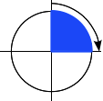

# CSS3

[https://developer.mozilla.org/zh-CN/docs/Learn/CSS](https://developer.mozilla.org/zh-CN/docs/Learn/CSS)

CSS也叫层叠性样式表，它是用来指定文档如何展示给用户的一门语言，CSS可以用于给文档添加样式，比如改变文字的颜色及大小，也可用于创建布局，甚至还可以用来做一些特效，比如动画。CSS的内容非常庞杂，本章主要挑选一些常用的重点来结合实例进行讲解。更多详细内容可自己参阅MDN相关教程

- CSS规则
- 常用选择器类型
- 层叠与继承
- 盒子模型
- 背景和边框
- 溢出的内容
- CSS的值和单位
- 文字排版
- 变换
- 过渡
- 动画
- 定位
- Flex弹性盒子布局
- Grid网格布局

## CSS规则

[https://developer.mozilla.org/zh-CN/docs/Learn/Getting_started_with_the_web/CSS_basics](https://developer.mozilla.org/zh-CN/docs/Learn/Getting_started_with_the_web/CSS_basics)


- 选择器（Selector）：HTML 元素的名称位于规则集开始。它选择了一个或多个需要添加样式的元素（在这个例子中就是 p 元素）。要给不同元素添加样式只需要更改选择器就行了。
- 声明（Declaration）：一个单独的规则，如 color: red; 用来指定添加样式元素的属性。
- 属性（Properties）：改变 HTML 元素样式的途径。（本例中 color 就是 `<p>` 元素的属性。）CSS 中，由编写人员决定修改哪个属性以改变规则。
- 属性的值（Property value）：在属性的右边，冒号后面即属性的值，它从指定属性的众多外观中选择一个值（我们除了 red 之外还有很多属性值可以用于 color ）。

### 其他规则

- 每个规则集（除了选择器的部分）都应该包含在成对的大括号里（{}）。
- 在每个声明里要用冒号（:）将属性与属性值分隔开。
- 在每个规则集里要用分号（;）将各个声明分隔开。
- 如果要同时修改多个属性，只需要将它们用分号隔开，如
  
  ```css
  p {
    color: red;
    width: 500px;
    border: 1px solid black;
  }
  ```
- 可以选择多种类型的元素并为它们添加一组相同的样式。将不同的选择器用逗号分开。例如
  
  ```css
  p, li, h1 {
    color: red;
  }
  ```

## 常用选择器类型

[https://developer.mozilla.org/zh-CN/docs/Learn/CSS/Building_blocks/Selectors](https://developer.mozilla.org/zh-CN/docs/Learn/CSS/Building_blocks/Selectors)

CSS选择器是CSS规则的第一部分。它是元素和其他部分组合起来告诉浏览器哪个HTML元素应当是被选为应用规则中的CSS属性值的方式。选择器所选择的元素，叫做“选择器的对象”。下面我们介绍几种常见的选择器类型。

- 类型选择器，通过node节点名称匹配元素. 因此,在单独使用时,寻找特定类型的元素时,元素选择器都会匹配该文档中所有此类型的元素

  ```css
  h1 {
    color: red;
  }
  ```
- ID选择器，在一个HTML文档中,CSS ID 选择器会根据该元素的 ID 属性中的内容匹配元素,元素 ID 属性名必须与选择器中的 ID 属性名完全匹配，此条样式声明才会生效。

  ```css
  #demo {
    border: red 2px solid;
  }
  ```

- 类选择器，在一个HTML文档中，CSS类选择器会根据元素的类属性中的内容匹配元素。类属性被定义为一个以空格分隔的列表项，在这组类名中，必须有一项与类选择器中的类名完全匹配，此条样式声明才会生效。以下示例中的三个选择器所起的作用各不相同

  ```css
  .classy {
    background-color: red;
  }

  div .classy {
    background-color: blue;
  }

  span.classy {
    background-color: green;
  }
  ```

  ```html
  <div class="classy">
    <div>AAAAA</div>
    <div>
      <div class="classy">BBB</div>
    </div>
    <span class="classy">CCC</span>
  </div>
  ```

- 属性选择器，通过已经存在的属性名或属性值匹配元素。

  ```css
  a[title] {
    color: purple;
  }
  ```

- 伪类，伪类是添加到选择器的关键字，指定要选择的元素的特殊状态。例如，`:hover` 可被用于在用户将鼠标悬停在按钮上时改变按钮的颜色。

  ```css
  /* 所有用户指针悬停的按钮 */
  button:hover {
    color: blue;
  }
  ```

  伪类连同伪元素一起，他们允许你不仅仅是根据文档 DOM 树中的内容对元素应用样式，而且还允许你根据诸如像导航历史这样的外部因素来应用样式（例如 `:visited`），同样的，可以根据内容的状态（例如在一些表单元素上的 `:checked`），或者鼠标的位置（例如 `:hover` 让你知道是否鼠标在一个元素上悬浮）来应用样式。更多关于伪类的用法参考：
[https://developer.mozilla.org/zh-CN/docs/Web/CSS/Pseudo-classes](https://developer.mozilla.org/zh-CN/docs/Web/CSS/Pseudo-classes)

- 伪元素，伪元素是一个附加至选择器末的关键词，允许你对被选择元素的特定部分修改样式。下例中的 `::after` 用来创建一个伪元素，作为已选中元素的最后一个子元素。通常会配合content属性来为该元素添加装饰内容。这个虚拟元素默认是行内元素。

  ```css
  /* 在每个链接的末尾添加一个箭头 */
  a::after {
    content: "→";
  }
  ```

- 后代选择器，后代组合器（通常用单个空格字符表示）组合了两个选择器，如果第二个选择器匹配的元素具有与第一个选择器匹配的祖先元素，则它们将被选择。利用后代组合器的选择器称为后代选择器。

  ```css
  /* 选择div元素下的所有p元素 */
  div p {
    border: 1px solid red;
  }
  ```

- 子选择器，当使用 `>` 选择符分隔两个元素时，它只会匹配那些作为第一个元素的直接后代(子元素)的第二元素。与之相比，当两个元素由 `后代选择器` 相连时，它表示匹配存在的所有由第一个元素作为祖先元素(但不一定是父元素)的第二个元素, 无论它在 DOM 中"跳跃" 多少次

  ```css
  /* 选择div元素下的第一级子p元素 */
  div > p {
    border: 1px solid red;
  }
  ```

## 层叠与继承

### 层叠

简单的说，css规则的顺序很重要；当应用两条同级别的规则到一个元素的时候，写在后面的就是实际使用的规则。下面的例子中，我们有两个关于 h1 的规则。h1 最后显示蓝色 — 这些规则有相同的优先级，所以顺序在最后的生效。

```css
h1 { 
  color: red; 
}
h1 { 
  color: blue; 
}
```

```html
<h1>This is my heading.</h1>
```

### 优先级

浏览器是根据优先级来决定当多个规则有不同选择器对应相同的元素的时候需要使用哪个规则。它基本上是一个衡量选择器具体选择哪些区域的尺度：

- 一个元素选择器不是很具体 — 会选择页面上该类型的所有元素 — 所以它的优先级就会低一些。
- 一个类选择器稍微具体点 — 它会选择该页面中有特定 class 属性值的元素 — 所以它的优先级就要高一点。

下面我们再来介绍两个适用于 h1 的规则。下面的 h1 最后会显示红色 — 类选择器有更高的优先级，因此就会被应用——即使元素选择器顺序在它后面。

```css
.main-heading { 
  color: red; 
}
        
h1 { 
  color: blue; 
}
```

```html
<h1 class="main-heading">This is my heading.</h1>
```

这里需要注意虽然我们考虑的是选择器，以及应用在选中对象上的规则，但不会覆盖所有规则，只有相同的属性。

这样可以避免重复的 CSS。一种常见的做法是给基本元素定义通用样式，然后给不同的元素创建对应的类。举个例子，在下面的样式中我给2级标题定义了通用样式，然后创建了一些类只修改部分属性的值。最初定义的值应用于所有标题，然后更具体的值通过对应类来实现。

```css
h2 {
  font-size: 2em;
  color: #000;
  font-family: Georgia, 'Times New Roman', Times, serif;
}
        
.small {
  font-size: 1em;
}
        
.bright {
  color: rebeccapurple;
} 
```

```html
<h2>Heading with no class</h2>
<h2 class="small">Heading with class of small</h2>
<h2 class="bright">Heading with class of bright</h2>
```

现在让我们来看看浏览器如何计算优先级。我们已经知道一个元素选择器比类选择器的优先级更低会被其覆盖。本质上，不同类型的选择器有不同的分数值，把这些分数相加就得到特定选择器的权重，然后就可以进行匹配。

一个选择器的优先级可以说是由四个部分相加 (分量)，可以认为是个十百千 — 四位数的四个位数：

- **千位：** 如果声明在 style 的属性（内联样式）则该位得一分。这样的声明没有选择器，所以它得分总是1000。
- **百位**： 选择器中包含ID选择器则该位得一分。
- **十位**： 选择器中包含类选择器、属性选择器或者伪类则该位得一分。
- **个位**：选择器中包含元素、伪元素选择器则该位得一分。

> 警告: 在进行计算时不允许进行进位，例如，20 个类选择器仅仅意味着 20 个十位，而不能视为 两个百位，也就是说，无论多少个类选择器的权重叠加，都不会超过一个 ID 选择器。

选择器 | 千位 | 百位 | 十位 | 个位 | 优先级
------|------|------|------|-----|-------
h1 | 0 | 0 | 0 | 1 | 0001
h1 + p::first-letter | 0 | 0 | 0 | 3 | 0003
li > a[href*="en-US"] > .inline-warning | 0 | 0 | 2 | 2 | 0022
\#identifier | 0 | 1 | 0 | 0 | 0100
内联样式 | 1 | 0 | 0 | 0 | 1000

有一个特殊的 CSS 可以用来覆盖所有上面所有优先级计算 `!important`。用于修改特定属性的值，能够覆盖普通规则的层叠。

<font color="red">**注意：除非特殊情况，否则不应该在常规代码中使用 `!important`**</font>

> 思考：下面选择器的优先级各是多少？

- `#container .title`
- `h1.title > span`

<font color="red">**注意：学习优先级的规则是为了让大家理解CSS的工作机制，实际开发中尽可能避免使用复杂的选择器，会降低代码的可读性，保持简单易懂！**</font>

### 继承

一些设置在父元素上的css属性是可以被子元素继承的，比如 `color`、`font-size`，每个在里面的元素也都会有相同的属性，除非你直接在元素上设置属性。有些属性如 `width`、`margin`、`border`等，则不会被继承，举例如下

```css
body {
  color: blue;
}

span {
  color: black;
}
```

```html
<p>
  As the body has been set to have a color of blue this is inherited through the descendants.
</p>
<p>
  We can change the color by targetting the element with a selector, such as this <span>span</span>.
</p>
```

### CSS位置的影响

CSS声明的重要性取决于样式表中指定的——它让用户可以设置自定义样式表来覆盖开发人员定义的样式。相互冲突的声明将按以下顺序适用，后一种声明将覆盖前一种声明：

- 用户代理样式表中的声明(例如，浏览器的默认样式，在没有设置其他样式时使用)。
- 用户样式表中的常规声明(由用户设置的自定义样式)。
- 作者样式表中的常规声明(这些是我们web开发人员设置的样式)。
- 作者样式表中的!important声明
- 用户样式表中的!important 声明

对于web开发人员的样式表来说，覆盖用户样式表是有意义的，因此设计可以按预期进行，但是有时用户充足的理由覆盖web开发人员样式，正如上面提到的—这可以通过在他们的规则中使用!important来实现。

## 盒子模型

在 CSS 中，所有的元素都被一个个的“盒子（box）”包围着，理解这些“盒子”的基本原理，是我们使用CSS实现准确布局、处理元素排列的关键。

[https://developer.mozilla.org/zh-CN/docs/Learn/CSS/Building_blocks/The_box_model](https://developer.mozilla.org/zh-CN/docs/Learn/CSS/Building_blocks/The_box_model)

在 CSS 中我们广泛地使用两种“盒子” —— 块级盒子 (block box) 和 内联盒子 (inline box)。这两种盒子会在页面流（page flow）和元素之间的关系方面表现出不同的行为:

### 块级盒子（Block box）

一个被定义成块级的（block）盒子会表现出以下行为:

- 盒子会在内联的方向上扩展并占据父容器在该方向上的所有可用空间，在绝大数情况下意味着盒子会和父容器一样宽
- 每个盒子都会换行
- `width` 和 `height` 属性可以发挥作用
- 内边距 `padding`, 外边距 `margin` 和 边框 `border` 会将其他元素从当前盒子周围“推开”

除非特殊指定，诸如标题(`<h1>`等)和段落(`<p>`)默认情况下都是块级的盒子。

### 内联盒子（Inline box）

如果一个盒子对外显示为 `inline`，那么他的行为如下:

- 盒子不会产生换行。
- `width` 和 `height` 属性将不起作用。
- 垂直方向的内边距、外边距以及边框会被应用但是不会把其他处于 inline 状态的盒子推开。
- 水平方向的内边距、外边距以及边框会被应用且会把其他处于 inline 状态的盒子推开。

用做链接的 `<a>` 元素、 `<span>`、 `<strong>` 都是默认处于 `inline` 状态的

我们通过对盒子 `display` 属性的设置，比如 `inline` 或者 `block` ，来控制盒子的外部显示类型。

### 盒子模型的组成部分

- **Content box**：这个区域是用来显示内容，大小可以通过设置 `width` 和 `height`.
- **Padding box**: 包围在内容区域外部的空白区域； 大小通过 `padding` 相关属性设置。
- **Border box**: 边框盒包裹内容和内边距。大小通过 `border` 相关属性设置。
- **Margin box**: 这是最外面的区域，是盒子和其他元素之间的空白区域。大小通过 `margin` 相关属性设置。

  

### 标准盒子模型

在标准模型中，如果你给盒设置 `width` 和 `height`，实际设置的是 `content box`。 `padding` 和 `border` 再加上设置的宽高一起决定整个盒子的大小。 见下图。

  

假设定义了 `width`, `height`, `margin`, `border`, `padding`:

```css
.box {
  width: 350px;
  height: 80px;
  margin: 25px;
  padding: 25px;
  border: 5px solid black;
}
```

如果使用标准模型宽度 = 410px (350 + 25 + 25 + 5 + 5)，高度 = 140px (80 + 25 + 25 + 5 + 5)，`padding` 加 `border` 再加 `content box`。

> **注**: margin 不计入实际大小 —— 当然，它会影响盒子在页面所占空间，但是影响的是盒子外部空间。盒子的范围到边框为止 —— 不会延伸到margin。

### 替代盒子模型

你可能会认为盒子的大小还要加上边框和内边距，这样很麻烦，而且你的想法是对的! 因为这个原因，css还有一个替代盒模型。使用这个模型，所有宽度都是可见宽度，所以内容宽度是该宽度减去边框和填充部分。使用上面相同的样式得到 (width = 350px, height = 80px)。

  

默认浏览器会使用标准模型。如果需要使用替代模型，您可以通过为其设置 `box-sizing`: `border-box` 来实现。 这样就可以告诉浏览器使用 `border-box` 来定义区域，从而设定您想要的大小。

如果你希望所有元素都使用替代模式，而且确实很常用，设置 box-sizing 在 `<html>` 元素上，然后设置所有元素继承该属性，正如下面的例子。

```css
html {
  box-sizing: border-box;
}

*, *::before, *::after {
  box-sizing: inherit;
}
```

## 背景和边框

在这一部分内容中，我们来使用CSS背景和边框来做一些具有一些创造性的事情。渐变、背景图像和圆角，背景和边框的巧妙运用是CSS中许多样式问题的答案。[https://developer.mozilla.org/zh-CN/docs/Learn/CSS/Building_blocks/Backgrounds_and_borders](https://developer.mozilla.org/zh-CN/docs/Learn/CSS/Building_blocks/Backgrounds_and_borders)

### 背景颜色

`background-color` 属性定义了CSS中任何元素的背景颜色。属性接受任何有效的`color` 值。背景色扩展到元素的内容和内边距的下面。

> 如果除了背景图像外，还指定了背景颜色，则图像将显示在颜色的顶部。尝试向上面的示例添加一个 `background-color` 属性，看看效果如何。

### 背景图片

`background-image` 属性允许在元素的背景中显示图像。默认情况下，大图不会缩小以适应方框，因此我们只能看到它的一个小角，而小图则是平铺以填充方框。在这种情况下，实际的图像只是单独的一颗星星。

### 渐变背景

当渐变用于背景时，也可以使用像图像一样的 `background-image` 属性设置，具体可以参考示例代码。

### background 简写

此属性是一个 简写属性，可以在一次声明中定义一个或多个属性：`background-clip`、`background-color`、`background-image`、`background-origin`、`background-position`、`background-repeat`、`background-size`，和 `background-attachment`

对于所有简写属性，任何没有被指定的值都会被设定为它们的初始值

```css
/* 使用 <background-color> */
background: green;

/* 使用 <bg-image> 和 <repeat-style> */
background: url("test.jpg") repeat-y;
```

### 边框

在学习盒子模型时，我们发现了边框如何影响盒子的大小。在这节课中，我们将看看如何创造性地使用边界。通常，当我们使用CSS向元素添加边框时，我们使用一个简写属性在一行CSS中设置边框的颜色、宽度和样式。我们可以使用 `border` 为一个框的所有四个边设置边框。

```css
.box {
  border: 1px solid black;
} 
```

或者我们可以只设置盒子的一个边，例如:

```css
.box {
  border-top: 1px solid black;
} 
```

这些简写的等价于：

```css
.box {
  border-width: 1px;
  border-style: solid;
  border-color: black;
}
```

也可以使用更加细粒度的属性：

```css
.box {
  border-top-width: 1px;
  border-top-style: solid;
  border-top-color: black;
}
```

### 圆角

通过使用 `border-radius` 属性和与方框的每个角相关的长边来实现方框的圆角。可以使用两个长度或百分比作为值，第一个值定义水平半径，第二个值定义垂直半径。在很多情况下，您将只传递一个值，这两个值都将使用。[https://developer.mozilla.org/zh-CN/docs/Web/CSS/border-radius](https://developer.mozilla.org/zh-CN/docs/Web/CSS/border-radius)


例如，要使一个盒子的四个角都有10px的圆角半径：

```css
.box {
  border-radius: 10px;
} 
```

或使右上角的水平半径为1em，垂直半径为10％：

```css
.box {
  border-top-right-radius: 1em 10%;
} 
```

### 阴影

[https://developer.mozilla.org/zh-CN/docs/Web/CSS/box-shadow](https://developer.mozilla.org/zh-CN/docs/Web/CSS/box-shadow)

CSS `box-shadow` 属性用于在元素的框架上添加阴影效果。你可以在同一个元素上设置多个阴影效果，并用逗号将他们分隔开。该属性可设置的值包括阴影的X轴偏移量、Y轴偏移量、模糊半径、扩散半径和颜色，基本语法如下

```css
.box {
  /* x偏移量 | y偏移量 | 阴影模糊半径 | 阴影扩散半径 | 阴影颜色 */
  box-shadow: 2px 2px 2px 1px rgba(0, 0, 0, 0.2);
}

.inset {
  /* 内阴影 | x偏移量 | y偏移量 | 阴影模糊半径 | 阴影扩散半径 | 阴影颜色 */
  box-shadow: inset 2px 2px 2px 1px rgba(0, 0, 0, 0.2);
}
```

取值

- `inset`：如果没有指定inset，默认阴影在边框外，即阴影向外扩散。
使用 inset 关键字会使得阴影落在盒子内部，这样看起来就像是内容被压低了。 此时阴影会在边框之内 (即使是透明边框）、背景之上、内容之下。
- `offset-x`、`offset-y`：这是头两个 `length` 值，用来设置阴影偏移量。x,y 是按照数学二维坐标系来计算的，只不过y垂直方向向下。`offset-x` 设置水平偏移量，正值阴影则位于元素右边，负值阴影则位于元素左边。 `offset-y` 设置垂直偏移量，正值阴影则位于元素下方，负值阴影则位于元素上方。如果两者都是0，那么阴影位于元素后面。
- `blur-radius`：这是第三个 `length` 值。值越大，模糊面积越大，阴影就越大越淡。 不能为负值。默认为0，此时阴影边缘锐利。本规范不包括如何计算模糊半径的精确算法。
- `spread-radius`：这是第四个 `length` 值。取正值时，阴影扩大；取负值时，阴影收缩。默认为0，此时阴影与元素同样大。
- `color`：指定阴影颜色。

`box-shadow` 参数可以简写，也可以对同一个元素添加多个阴影效果，请使用逗号将每个阴影规则分隔开。[https://developer.mozilla.org/zh-CN/docs/Web/CSS/box-shadow#syntax](https://developer.mozilla.org/zh-CN/docs/Web/CSS/box-shadow#syntax)

> 练习：尝试设置不同的阴影参数查看效果

## 溢出的内容

在这一部分我们来了解一下CSS中另外一个重要的概念——溢出。溢出是在盒子无法容纳下太多的内容的时候发生的。在这篇教程里面，你将会学习到什么是溢出，以及如何控制它。

### 什么是溢出

我们知道，CSS中万物皆盒，因此我们可以通过给 `width` 和 `height` 赋值的方式来约束盒子的尺寸。溢出是在你往盒子里面塞太多东西的时候发生的，所以盒子里面的东西也不会老老实实待着。CSS给了你好几种工具来控制溢出，在学习的早期理解这些概念是很有用的。在你写CSS的时候你经常会遇到溢出的情形，尤其是当你以后更加深入到CSS布局的时候。

### overflow 属性

`overflow` 属性是你控制一个元素溢出的方式，它告诉浏览器你想怎样处理溢出。 `overflow` 的默认值为 `visible`，这就是我们的内容溢出的时候，我们在默认情况下看到它们的原因。

如果你想在内容溢出的时候把它裁剪掉，你可以在你的盒子上设置 `overflow: hidden`。这就会像它表面上所显示的那样作用——隐藏掉溢出。这可能会很自然地让东西消失掉，所以你只应该在判断隐藏内容不会引起问题的时候这样做。

如果你想在有比盒子所能装下更多的内容的时候显示滚动条，那么使用 `overflow: auto`。此时由浏览器决定是否显示滚动条。桌面浏览器一般仅仅会在有足以引起溢出的内容的时候这么做。

## CSS的值和单位

[https://developer.mozilla.org/zh-CN/docs/Learn/CSS/Building_blocks/Values_and_units](https://developer.mozilla.org/zh-CN/docs/Learn/CSS/Building_blocks/Values_and_units)

这里列举几种常用的单位

- **px**，像素，绝对单位
- **em**，在 `font-size` 中使用是相对于父元素的字体大小，在其他属性中使用是相对于自身的字体大小，如 `width`
- **rem**，`html` 根元素的字体大小
- **百分比**，在许多情况下，百分比与长度的处理方法是一样的。百分比的问题在于，它们总是相对于其他值设置的。例如，如果将元素的字体大小设置为百分比，那么它将是元素父元素字体大小的百分比。如果使用百分比作为宽度值，那么它将是父值宽度的百分比。
- **数字**，有些值接受数字，不添加任何单位。接受无单位数字的属性的一个例子是不透明度属性（`opacity` ），它控制元素的不透明度(它的透明程度)。此属性接受0(完全透明)和1(完全不透明)之间的数字。
- **颜色**，在CSS中指定颜色的方法有很多，其中一些是最近才实现的。在CSS中，相同的颜色值可以在任何地方使用，无论您指定的是文本颜色、背景颜色还是其他颜色。

  现代计算机的标准颜色系统是24位的，它允许通过不同的红、绿、蓝通道的组合显示大约1670万种不同的颜色，每个通道有256个不同的值(256 x 256 x 256 = 16,777,216)。让我们来看看在CSS中指定颜色的一些方法。

  - 颜色关键词，这是一种指定颜色的简单易懂的方式，具体关键词列表可以查阅 [\<color\>](https://developer.mozilla.org/en-US/docs/Web/CSS/color_value)

    ```css
    p {
      color: red;
    }
    ```

  - 十六进制RGB值，你可能遇到的下一种颜色值类型是十六进制代码。每个十六进制值由一个(#)和六个十六进制数字组成，每个十六进制数字都可以取0到f(代表15)之间的16个值中的一个——所以是0123456789abcdef。每对值表示一个通道—红色、绿色和蓝色—并允许我们为每个通道指定256个可用值中的任意一个(16 x 16 = 256)。

    ```css
    p {
      color: #ff0000;
    }
    ```

  - RGB 和 RGBA的值，我们将在这里讨论的第三种方案是RGB。RGB值是一个函数—RGB()—它有三个参数，表示颜色的红色、绿色和蓝色通道值，与十六进制值的方法非常相似。RGB的不同之处在于，每个通道不是由两个十六进制数字表示的，而是由一个介于0到255之间的十进制数字表示的——这有点容易理解。

    ```css
    p {
      color: rgb(255, 0, 0);
    }
    ```
  
    你还可以使用RGBA颜色——它们的工作方式与RGB颜色完全相同，因此您可以使用任何RGB值，但是有第四个值表示颜色的alpha通道，它控制不透明度。如果将这个值设置为0，它将使颜色完全透明，而设置为1将使颜色完全不透明。介于两者之间的值提供了不同级别的透明度。

    ```css
    p {
      color: rgba(255, 0, 0, 0.5);
    }
    ```

- 位置，`position` 数据类型表示一组2D坐标，用于定位一个元素，如背景图像(通过 `background-position`)。它可以使用关键字(如 `top`, `left`, `bottom`, `right`, 以及 `center` )将元素与2D框的特定边界对齐，以及表示框的顶部和左侧边缘偏移量的长度。示例
  
  ```css
  p {
    background-position: center;
  }
  ```

## 文字排版

元素中的文本是布置在元素的内容框中。以内容区域的左上角作为起点 (或者是右上角，是在 RTL 语言的情况下)，一直延续到行的结束部分。一旦达到行的尽头，它就会进到下一行，然后继续，再接着下一行，直到所有内容都放入了盒子中。文本内容表现地像一些内联元素，被布置到相邻的行上，除非到达了行的尽头，否则不会换行，或者你想强制地，手动地造成换行的话，你可以使用 `<br>` 元素。

### 颜色

`color` 属性设置选中元素的前景内容的颜色 (通常指文本，不过也包含一些其他东西，比如使用 `text-decoration` 属性设置的下划线。

### 字体种类

要在你的文本上设置一个不同的字体，你可以使用 font-family  属性，这个允许你为浏览器指定一个字体 (或者一个字体的列表)，然后浏览器可以将这种字体应用到选中的元素上。浏览器只会把在当前机器上可用的字体应用到当前正在访问的网站上；如果字体不可用，那么就会用浏览器默认的字体代替 default font. 下面是一个简单的例子：

```css
p {
  font-family: arial;
}
```

这段语句使所有在页面上的段落都采用 `arial` 字体，这个字体可在任何电脑上找到。

由于你无法保证你想在你的网页上使用的字体的可用性 (甚至一个网络字体可能由于某些原因而出错), 你可以提供一个字体栈 (font stack)，这样的话，浏览器就有多种字体可以选择了。只需包含一个font-family属性，其值由几个用逗号分离的字体名称组成。比如

```css
p {
  font-family: "Trebuchet MS", Verdana, sans-serif;
}
```

在这种情况下，浏览器从列表的第一个开始，然后查看在当前机器中，这个字体是否可用。如果可用，就把这个字体应用到选中的元素中。如果不可用，它就移到列表中的下一个字体，然后再检查。

### 字体大小

我们可以通过 `font-size` 属性设置字体大小，最常用的单位是

- **px**：像素，这是一个绝对单位，它导致了在任何情况下，页面上的文本所计算出来的像素值都是一样的。
- **em**：1em 等于我们设计的当前元素的父元素上设置的字体大小
- **rem**：这个单位的效果和 em 差不多，除了 1rem 等于 HTML 中的根元素的字体大小，而不是父元素。这可以让你更容易计算字体大小

元素的 `font-size` 属性是从该元素的父元素继承的。所以这一切都是从整个文档的根元素 — `<html>`开始，浏览器的 font-size 标准设置的值为 16px。

一个使用 `rem` 单位的示例，在移动端适配的时候会变得很有用

```css
html {
  font-size: 10px;
}

h1 {
  font-size: 2.6rem;
}

p {
  font-size: 1.4rem;
  color: red;
  font-family: Helvetica, Arial, sans-serif;
}
```

### 文字样式

- **font-style**：用来打开和关闭文本 italic (斜体)，一般只会用到下面的值
  -  `italic`：如果当前字体的斜体版本可用，那么文本设置为斜体版本。
- **font-weight**：置文字的粗体大小
  - `normal`：普通
  - `bold`：加粗
- **text-decoration**：设置/取消字体上的文本装饰
  - `none`：取消已经存在的任何文本装饰
  - `underline`：文本下划线
  - `overline`：本上划线
  - `line-through`：穿过文本的线
- **text-align**：用来控制文本如何和它所在的内容盒子对齐。可用值如下，并且在与常规文字处理器应用程序中的工作方式几乎相同：
  - `left`：左对齐文本
  - `right`：右对齐文本
  - `center`：居中文字
- **line-height**：设置文本每行之间的高，可以接受大多数单位，不过也可以设置一个无单位的值，作为乘数，通常这种是比较好的做法。无单位的值乘以 `font-size` 来获得 `line-height`。当行与行之间拉开空间，正文文本通常看起来更好更容易阅读。推荐的行高大约是 1.5–2 (双倍间距) 所以要把我们的文本行高设置为字体高度的1.5倍，你可以使用这个:

  ```css
  p {
    line-height: 1.5;
  }
  ```

## CSS变换

[https://developer.mozilla.org/zh-CN/docs/Web/CSS/transform](https://developer.mozilla.org/zh-CN/docs/Web/CSS/transform)

CSS `transform` 属性允许你旋转，缩放，倾斜或平移给定元素。这是通过修改CSS视觉格式化模型的坐标空间来实现的，比较常用的有以下几个

- translate：移动
- scale：缩放
- rotate：旋转

> 示例

```CSS
transform: translate(12px, 50%);
transform: scale(2, 0.5);
transform: rotate(10deg);
```

### angle 角度

`angle` 用于表示角的大小，常用单位有度（`degrees`）、圈数（`turns`）。在 `gradient` 和 `transform` 的某些方法等场景中有所应用。

- `deg`：度，一个完整圆是 `360deg`，例如：`0deg`，`90deg`
- `turn`：圈数，一个完整的圆是 `1turn`,例如：`0turn`，`0.25turn`，`1.2turn`

示意图 | 度数    
------|------
 | 直角：90deg = 0.25turn
 | 平角：180deg = 0.5turn
 | 直角（逆时针）：-90deg = -0.25turn
 | 零角：0 = 0deg = 0turn

## CSS过渡

[https://developer.mozilla.org/zh-CN/docs/Web/CSS/CSS_Transitions/Using_CSS_transitions](https://developer.mozilla.org/zh-CN/docs/Web/CSS/CSS_Transitions/Using_CSS_transitions)


CSS `transition` 提供了一种在更改CSS属性时控制动画速度的方法。其可以让属性变化成为一个持续一段时间的过程，而不是立即生效的。比如，将一个元素的颜色从白色改为黑色，通常这个改变是立即生效的，使用 CSS `transition` 后该元素的颜色将逐渐从白色变为黑色，按照一定的曲线速率变化，这样可以让状态的切换变得更平滑，而不是那么生硬。

通常将两个状态之间的过渡称为 `隐式过渡（implicit transitions）`，因为开始与结束之间的状态由浏览器决定。

- transition-property：应用过渡效果的属性
- transition-duration：过渡时间
- transition-timing-function：过渡函数
- transition-delay：等待时间

也可以简写，如

```CSS
.trans {
  transition: all 0.5s ease-out;
}
```

## CSS动画

[https://developer.mozilla.org/zh-CN/docs/Web/CSS/CSS_Animations/Using_CSS_animations](https://developer.mozilla.org/zh-CN/docs/Web/CSS/CSS_Animations/Using_CSS_animations)

CSS `animation` 使得可以将从一个CSS样式配置转换到另一个CSS样式配置。动画包括两个部分：描述动画的样式规则和用于指定动画开始、结束以及中间点样式的关键帧。示例如下

```css
p {
  /* 持续时间 | 动画名称 */
  animation: 3s slidein;
}
```

### 使用keyframes定义动画序列

一旦完成动画的时间设置， 接下来就需要定义动画的表现。通过使用 `@keyframes` 建立两个或两个以上关键帧来实现。每一个关键帧都描述了动画元素在给定的时间点上应该如何渲染。

因为动画的时间设置是通过CSS样式定义的，关键帧使用 `percentage` 来指定动画发生的时间点。`0%` 表示动画的第一时刻，`100%` 表示动画的最终时刻。因为这两个时间点十分重要，所以还有特殊的别名：`from` 和 `to`。这两个都是可选的，若 `from/0%` 或 `to/100%` 未指定，则浏览器使用计算值开始或结束动画。

也可包含额外可选的关键帧，描述动画开始和结束之间的状态，示例如下

```css
p {
  animation: 3s slidein;
}

@keyframes slidein {
  from {
    margin-left: 100%;
    width: 300%;
  }

  to {
    margin-left: 0%;
    width: 100%;
  }
}
```

### 重复动画

`animation-iteration-count` 用以指定动画重复的次数，仅仅使用该属性就能使动画重复播放。在该例中，设该属性为 `infinite` 以使动画无限重复

```css
p {
  animation-duration: 3s;
  animation-name: slidein;
  animation-iteration-count: infinite;
}
```

## 定位

### 文档流

定位是一个相当复杂的话题，默认情况下，块级元素的内容宽度是其父元素的宽度的100％，并且与其内容一样高。内联元素高宽与他们的内容高宽一样。您不能对内联元素设置宽度或高度——它们只是位于块级元素的内容中。

正常的布局流是将元素放置在浏览器视口内的系统。默认情况下，块级元素在视口中垂直布局——每个都将显示在上一个元素下面的新行上，并且它们的外边距将分隔开它们。

内联元素表现不一样——它们不会出现在新行上；相反，它们互相之间以及任何相邻（或被包裹）的文本内容位于同一行上，只要在父块级元素的宽度内有空间可以这样做。如果没有空间，那么溢流的文本或元素将向下移动到新行。

如果两个相邻元素都在其上设置外边距，并且两个外边距接触，则两个外边距中的较大者保留，较小的一个消失——这叫外边距折叠。

### 介绍定位

定位的整个想法是允许我们覆盖上面描述的基本文档流行为，以产生有趣的效果。如果你想稍微改变布局中一些盒子的位置，定位是你的工具。或者，如果您想要创建一个浮动在页面其他部分顶部的UI元素，并且或者始终停留在浏览器窗口内的相同位置，无论页面滚动多少？定位使这种布局工作成为可能。

有许多不同类型的定位，要使某个元素上的特定类型的定位，我们使用 `position` 属性。

#### 静态定位

静态定位是每个元素获取的默认值——它只是意味着“将元素放入它在文档布局流中的正常位置 ——这里没有什么特别的。

#### 相对定位

相对定位是我们将要看的第一个位置类型。它与静态定位非常相似，占据在正常的文档流中，除了你仍然可以修改它的最终位置，包括让它与页面上的其他元素重叠。让我们继续并更新代码中的 `position` 属性：

```css
.positioned {
  position: relative;
}
```

`top`, `bottom`, `left`, 和 `right` 来精确指定要将定位元素移动到的位置

```css
.positioned {
  position: relative;
  top: 30px;
  left: 30px;
}
```

相对定位工作的方式——你需要考虑一个看不见的力，推动定位的盒子的一侧，移动它的相反方向。所以，如果你指定 `top: 30px;` 一个力推动框的顶部，使它向下移动30px。

### 绝对定位

绝对定位带来了非常不同的结果。让我们尝试改变代码中的位置声明如下：

```css
.positioned {
  position: absolute;
  top: 30px;
  left: 30px;
}
```

首先，请注意，定位的元素应该在文档流中的间隙不再存在——第一和第三元素已经靠在一起，就像第二个元素不再存在！在某种程度上，这是真的。绝对定位的元素不再存在于正常文档布局流中。相反，它坐在它自己的层独立于一切。这是非常有用的：这意味着我们可以创建不干扰页面上其他元素的位置的隔离的UI功能。例如，弹出信息框和控制菜单；翻转面板；可以在页面上的任何地方拖放的UI功能……

第二，注意元素的位置已经改变——这是因为 `top`，`bottom`，`left` 和 `right` 以不同的方式在绝对定位。它们指定元素应距离每个包含元素的边的距离，而不是指定元素应该移入的方向。所以在这种情况下，我们说的绝对定位元素应该位于从“包含元素”的顶部30px，从左边30px。

### 定位上下文

哪个元素是绝对定位元素的“包含元素“？这取决于绝对定位元素的父元素的 `position` 属性。

如果所有的父元素都没有显式地定义position属性，那么所有的父元素默认情况下 `position` 属性都是 `static`。结果，绝对定位元素会被包含在初始块容器中。这个初始块容器有着和浏览器视口一样的尺寸，并且 `<html>` 元素也被包含在这个容器里面。简单来说，绝对定位元素会被放在 `<html>` 元素的外面，并且根据浏览器视口来定位。

我们可以改变定位上下文 —— 绝对定位的元素的相对位置元素。通过设置其中一个父元素的定位属性为相对定位。

### 介绍z-index

还有另一件事我们还没有考虑到 — 当元素开始重叠，什么决定哪些元素出现在其他元素的顶部？在我们已经看到的示例中，我们在定位上下文中只有一个定位的元素，它出现在顶部，因为定位的元素胜过未定位的元素。当我们有不止一个的时候呢？我们可以使用 `z-index` 属性来更改堆叠顺序，它代表z轴的参考，`z-index` 只接受无单位索引值,较高的值将高于较低的值，示例如下：

```css
.positioned {
  position: absolute;
  top: 30px;
  left: 30px;
  z-index: 100;
}
```

### 固定定位

还有一种类型的定位覆盖 — `fixed`。这与绝对定位的工作方式完全相同，只有一个主要区别：绝对定位固定元素是相对于 `<html>` 元素或其最近的定位祖先，而固定定位固定元素则是相对于浏览器视口本身。这意味着您可以创建固定的有用的UI项目，如持久导航菜单，示例：

```css
h1 {
  position: fixed;
  top: 0;
  width: 500px;
  background: white;
  padding: 10px;
}
```

<font color="red">**注意：定位技术通常只用来做一些局部的特殊效果，例如层叠菜单、弹出层等等，不要用来做整体的布局！**</font>

## Flex布局

[https://developer.mozilla.org/zh-CN/docs/Learn/CSS/CSS_layout/Flexbox](https://developer.mozilla.org/zh-CN/docs/Learn/CSS/CSS_layout/Flexbox)

弹性盒子是一种用于按行或按列布局元素的一维布局方法。元素可以膨胀以填充额外的空间, 收缩以适应更小的空间，Flex布局非常灵活和方便，是目前使用最广泛的布局技术，本章节将解释它的基本原理。

当元素表现为 flex 框时，它们沿着两个轴来布局：


- `主轴（main axis）` 是沿着 flex 元素放置的方向延伸的轴（比如页面上的横向的行、纵向的列）。该轴的开始和结束被称为 main start 和 main end。
- `交叉轴（cross axis）` 是垂直于 flex 元素放置方向的轴。该轴的开始和结束被称为 `cross start` 和 `cross end`。
- 设置了 `display: flex` 的父元素被称之为 flex 容器（`flex container`）。
- 在 `flex` 容器中表现为柔性的盒子的元素被称之为 `flex项`（`flex item`）

### 排列方向

弹性盒子提供了 `flex-direction` 这样一个属性，它可以指定主轴的方向（弹性盒子子类放置的地方）— 它默认值是 `row`，这使得它们在按你浏览器的默认语言方向排成一排（在英语/中文浏览器中是从左到右），如果更改为如下设置：

```css
.box {
  flex-direction: column;
}
```

你会看到，这会将那些元素设置为列布局。

### 换行

当你在布局中使用定宽或者定高的时候，可能会出现问题即处于容器中的 弹性盒子子元素会溢出，破坏了布局，解决此问题的一种方法是将以下声明添加到 `css` 规则中：

```css
.box {
  flex-wrap: wrap;
}

.item {
  flex: 200px;
}
```

### flex 项的动态尺寸

`flex` 属性是一个无单位的比例值，表示每个 `flex` 项沿主轴的可用空间大小。本例中，我们设置 `<article>` 元素的 flex 值为 1，这表示每个元素占用空间都是相等的，占用的空间是在设置 `padding` 和 `margin` 之后剩余的空间。因为它是一个比例，这意味着将每个 flex 项的设置为 `400000` 的效果和 `1` 的时候是完全一样的。

```css
article {
  flex: 1;
}
```

### 水平和垂直对齐

`align-items` 控制 flex 项在交叉轴上的位置。

- 默认的值是 `stretch`，其会使所有 `flex` 项沿着交叉轴的方向拉伸以填充父容器。如果父容器在交叉轴方向上没有固定宽度（即高度），则所有 `flex` 项将变得与最长的 `flex` 项一样长（即高度保持一致）。
- `center` 值会使这些项保持其原有的高度，但是会在交叉轴居中。
- 你也可以设置诸如 `flex-start` 或 `flex-end` 这样使 `flex` 项在交叉轴的开始或结束处对齐所有的值。

`justify-content` 控制 `flex` 项在主轴上的位置。

- 默认值是 `flex-start`，这会使所有 `flex` 项都位于主轴的开始处。
- 你也可以用 `flex-end` 来让 flex 项到结尾处。
- `center` 在 `justify-content` 里也是可用的，可以让 `flex` 项在主轴居中。
- `space-around` 是很有用的——它会使所有 `flex` 项沿着主轴均匀地分布，在任意一端都会留有一点空间。
- 还有一个值是 `space-between`，它和 `space-around` 非常相似，只是它不会在两端留下任何空间。

## Grid网格布局

[https://developer.mozilla.org/zh-CN/docs/Learn/CSS/CSS_layout/Grids](https://developer.mozilla.org/zh-CN/docs/Learn/CSS/CSS_layout/Grids)


CSS网格是一个用于web的二维布局系统。利用网格，你可以把内容按照行与列的格式进行排版。另外，网格还能非常轻松地实现一些复杂的布局。这一部分介绍关于使用网格进行页面排版的基本内容。

网格是由一系列水平及垂直的线构成的以一种布局模式。根据网格，我们能够将设计元素进行排列，帮助我们设计一系列具有固定位置以及宽度的元素的页面，使我们的网站页面更加统一。

一个网格通常具有许多的列（`column`）与行（`row`），以及行与行、列与列之间的间隙，这个间隙一般被称为沟槽（`gutter`）。

决定好你的设计所需要的网格后，你可以创建一个CSS网格版面并放入各类元素。我们先来看看网格的基础功能，然后尝试做一个简单的网格系统。

### 定义一个网格

首先，将容器的 `display` 属性设置为 `grid` 来定义一个网络。与弹性盒子一样，将父容器改为网格布局后，他的直接子项会变为网格项。把下面的css规则加到你的文件中。

```css
.container {
  display: grid;
}
```

与弹性盒子不同的是，在定义网格后，网页并不会马上发生变化。因为 `display: grid` 的声明只创建了一个只有一列的网格，所以你的子项还是会像正常布局流那样从上而下一个接一个的排布。

为了让我们的容器看起来更像一个网格，我们要给刚定义的网格加一些列。那就让我们加三个宽度为 `200px` 的列。当然，这里可以用任何长度单位，包括百分比。

```css
.container {
  display: grid;
  grid-template-columns: 200px 200px 200px;
}
```

### 使用fr单位的灵活网格

除了长度和百分比，我们也可以用fr这个单位来灵活地定义网格的行与列的大小。这个单位表示了可用空间的一个比例，可能有点抽像，看看下面的例子吧。

使用下面的规则来创建3个1fr的列：

```css
.container {
  display: grid;
  grid-template-columns: 1fr 1fr 1fr;
}
```

每一列的宽度可以会随着可用空间变小而变小。`fr` 单位按比例划分了可用空间，这个与弹性盒子布局中的 `flex` 属性类似，再看下面的代码

```css
.container {
  display: grid;
  grid-template-columns: 2fr 1fr 1fr;
}
```

这个定义里，第一列被分配了 `2fr` 可用空间，余下的两列各被分配了 `1fr` 的可用空间，这会使得第一列的宽度是第二第三列的两倍。另外，`fr` 可以与一般的长度单位混合使用，比如 `grid-template-columns: 300px 2fr 1fr`，那么第一列宽度是 `300px`，剩下的两列会根据除去 `300px` 后的可用空间按比例分配。

### 网格间隙

使用 `grid-column-gap` 属性来定义列间隙；使用 `grid-row-gap` 来定义行间隙；使用 `grid-gap` 可以同时设定两者。

```css
.container {
  display: grid;
  grid-template-columns: 2fr 1fr 1fr;
  grid-gap: 20px;
}
```

### 重复构建列

你可以使用 `repeat` 来重复构建具有某些宽度配置的某些列。举个例子，如果要创建多个等宽轨道，可以用下面的方法。

```css
.container {
  display: grid;
  grid-template-columns: repeat(3, 1fr);
  grid-gap: 20px;
}
```

和之前一样，你仍然得到了3个 `1fr` 的列。第一个传入 `repeat` 函数的值（`3`）表明了后续列宽的配置要重复多少次，而第二个值（`1fr`）表示需要重复的构建配置，这个配置可以具有多个长度设定。例如 `repeat(2, 2fr 1fr)`，如果你仍然不明白，可以实际测试一下效果，这相当于填入了 `2fr 1fr 2fr 1fr`。

## 综合示例

`demo/music.html` 是一个简化版的QQ音乐专辑库页面，综合性运用了很多前面讲到的CSS知识，还有一些高级用法在文档中没有提及。

## 课后任务

> 完成简化版的QQ音乐首页，效果图参考 `task.jpg`，要求

- 代码可参考 `demo/music.html`
- 自主完成，不得依赖外部框架或样式库
- 具体尺寸可通过QQ音乐首页或效果图测量
- 封面动态效果需要和 `demo` 保持一致
- 所需图标在 `demo/imgs` 目录下已有提供
- 所需数据已通过 `task.json` 提供，可用于页面填充
- 代码在下周四11:30分之前推送至Git服务的个人作业仓库的 `week-02` 目录下
- 在 `README.md` 记录作业完成的思路和遇到的问题

`task.json` 数据结构说明如下

- playlist：歌单推荐列表

  - title：标题
  - cover：封面图片地址
  - listen_num：播放量

- songlist：新歌首发列表
  
  - name：标题
  - singer：歌手名字集合
  - interval：时长（秒）
  - cover：封面图片地址

- mvlist：MV列表

  - title：标题
  - singer：歌手
  - listen_num：播放量
  - cover：封面图片地址

> 选做任务：学有余力的同学，可以尝试利用自己熟悉的技术，编写脚本读取 `task.json` 中的数据，自动完成html页面内容的填充，同时上传自己的脚本代码，该任务不做具体考核。