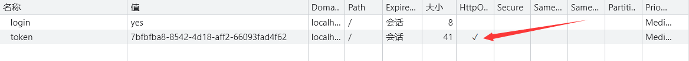

# Explorer 组大作业

## 模块划分

- 模块一:用户模块(注册、登录、个人中心)
- 模块二:表单模块(新建表单)
- 模块三:首页模块(展示表单列表和表单操作)
- 模块四:填写模块(数据统计、表单分享、表单问题详情、表单填写、新建表单)

## 小组分工

- 陈金咏：模块一
- 韦家瑶：模块二
- 罗响：模块三
- 田泽翔：模块四

## 项目说明

### 技术选型

- 框架
  - Vue3 + TS + VueRouter + Pinia
- UI 库
  - Element-plus
- 工具
  - lodash-es
  - axios
  - nanoid
  - dayjs
  - clipboardjs
  - vue-qr
- css 预处理
  - less

### 运行说明

启动
```
$ npm i
$ npm run serve
```

扫码
``` 
$ 设置host为无线局域网ipv4地址并处于同一网络下,并更改`views/new-form-result/formShare`文件里的qrCodeText变量，项目port为8080，确认项目启动后端口为8080，避免端口被占而改变。也可同时改变端口和地址。
```


## 每周(日)进度


### 0521

- 田泽翔: 项目基础框架搭建 & eslint 保存后自动代码格式化

### 0522

- 田泽翔: 表单结果构建 & 全局组件构建 & 修改 api 名 & view 名修改 & routes 名修改
- 罗响: 定义接口 & 封装 api 请求 & 定义路由 & 登录判断

### 0523

- 罗响：修改了响应的数据类型 & 修改了 axios 拦截器
- 田泽翔: 定义 httpEnum & 修改 any 类型为 unknown & 单独引入 elmessage 样式

### 0524

- 田泽翔：增加公共样式并修改滚动条条样式 & 完成表单详情一部分 & 完成全局公共组件 form-input-title 可
  用于表单详情和表单创建 & 修改 axios 的 ContentType

### 0525

- 田泽翔：新增全局公共组件 input-form-title 新属性 placeholder & 修改 el-input 光标闪烁偏移 bug & 完成七个问题类型组件

### 0526

- 田泽翔：新增全局公共组件 input-form-title 新插槽 prefix,原 prefix 属性更名 prefix-number-index & 完成表单问题页面 & 完成表单分享页面 & 重构页面布局，添加 baselayout & 重构 headerbar
- 罗响：抽取了组件 avatar-area 组件&完成了部分 home 页面布局

### 0527

- 田泽翔：修改 home & 新增 `element-plus.less`文件，用来处理全局 element-plus 样式 & 完成表单数据一部分 & 完成填写表单一部分
- 罗响：完成了首页表格部分的布局和功能实现
- 陈金咏：完成登录页面基本布局和功能

### 0528

- 罗响：完成了 home 页面的开发&将 home 页面 main 部分抽取成为 home 路由子路由的组件
- 田泽翔：新增全局组件 `form-layout`和 `problem-item` & 新增 formStore & 修改 `input-form`页面和 `form-problem`页面

### 0529

- 陈金咏：完成注册页面的开发和注册功能，完成注册页面的账号注册。修改登录页面和注册页面的布局样式。
- 田泽翔：修改 problem-item、form-layout 、formStore & 完成数据统计、表单分享、表单问题详情、表单填写基本布局

### 0530

- 韦家瑶：完成创建表单页面的基本布局

### 0531

- 陈金咏：修改注册页面样式，完成个人中心静态布局
- 田泽翔：新增组件 progress & 继续完善填写表单页面

### 0601

- 陈金咏：完成个人信息全局数据状态的更新，完成个人中心的修改密码和修改昵称的功能
- 田泽翔：新增WriteCatalog组件并重新对InputForm页面布局 & formStore请求处理

### 0602

- 韦家瑶：完成新建表单界面添加问题功能
- 罗响: 修改了 formApi 中的路径错误&修改 home 页面跳转其他页面需要的查询参数&新增一个登录成功后的自定义令牌
- 田泽翔：部分页面动态请求 & 问题分享下载、一键复制完成，扫码完成 & 一些页面布局bug & 表单填写部分适配

### 0603

- 田泽翔：填写表单移动适配 & 一些bug & 基本完成模块 & 重构新建表单页面 & 新增组件problem-create-card
- 罗响：修改了userStore的部分数据
- 陈金咏：修改了一些bug & 个人信息持久化 & 头像预览

### 0604
- 田泽翔：继续重构新建表单页面 & 完成创建表单页面所有操作
- 罗响：完成了添加常用题弹窗 & 完成时间选择题组件的样式
- 陈金咏：完成PullSelecting和RadioSelectSetting样式调整
- 韦家瑶：完成填空题、日期题、多选题样式调整

### 0604
- 田泽翔：继续重构新建表单页面 & 完成创建表单页面基本操作 & 重Setting组件逻辑、修改一些样式 & 完善一些bug & 增加formPreview组件

### 0605
- 田泽翔：完成重构表单页面 & 完成常用题管理数据处理和逻辑 & 增加nprogress、请求loading & 调试整个项目
- 陈金咏：修改了一下头像错误显示以及注册时设置头像的问题和一些bug

## 问题与解决方法

1. 登录成功后会在 cookie 中存储一个 token，在进行登录拦截的时候可以用这个进行判断。但是在测试的时候发现，弹出登录成功的消息之后一直处在登录页面，并未跳转，后来发现 token 值为 httpOnly 类型获取不到，所以所有请求都被强制跳转到了登录页。之后决定在登录成功后自定义一个标志存到 cookie 里面用来登录拦截的判断。
   
